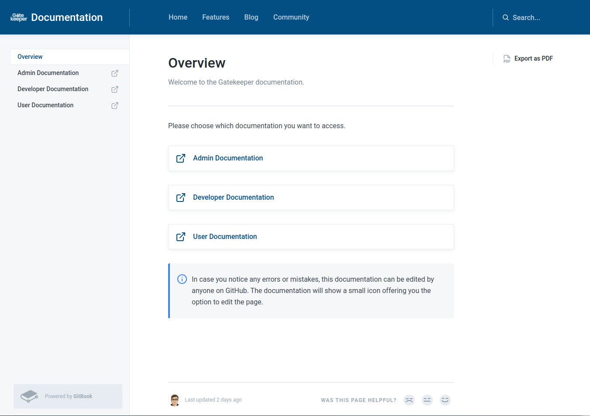

We just published our first version of the Gatekeeper Documentation for [administrators](https://docs.gatekeeper.page/admin/), [users](https://docs.gatekeeper.page/user/), and [developers](https://docs.gatekeeper.page/developer/). Check it out at [docs.gatekeeper.page](https://docs.gatekeeper.page/).

# Finding the right documentation software

We had a few criteria for the right documentation software. Those being:

1. Community members can contribute without hassles.
2. Data can be accessed using open formats.

While we initially considered going with [Sphinx](https://www.sphinx-doc.org/), the experience isn't quite where we want it. Installing it isn't straight forward, and reStructuredText isn't intuitive to many people.

We ultimately settled on [GitBook](https://www.gitbook.com/). Despite it not being an open-source solution, it offers us the following advantages:

- Regular contributors can edit the documentation using the GitBook web UI.
- Non-regular contributors can edit the documentation by making a Pull Request on GitHub.
- GitBook provides hosting for us. And since we are an open-source project, this even [for free](https://www.gitbook.com/pricing).

As GitBook stores the data using Markdown in GitHub, there is also not much vendor lock-in. Any potential migration to other services in the future should thus be easily possible.

# Helping contributing

We'd be happy for any contributions to our documentation. Just submit a Pull Request or Issue to our GitHub repositories, and we'd happily incorporate your changes.

- [GetGatekeeper/admin-documentation](https://github.com/GetGatekeeper/admin-documentation)
- [GetGatekeeper/user-documentation](https://github.com/GetGatekeeper/user-documentation)
- [GetGatekeeper/developer-documentation](https://github.com/GetGatekeeper/developer-documentation)
