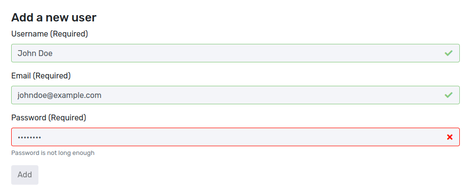
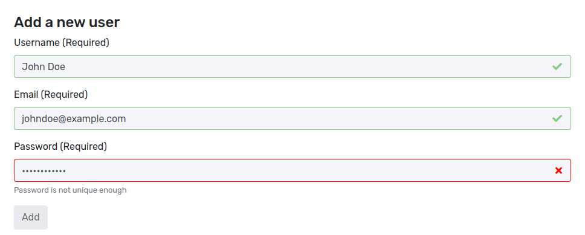
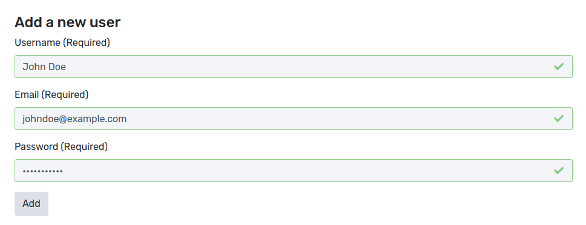

> &quot;Your password needs to contain a non-alphanumeric character and two upper-case characters.&quot;

Most people probably have seen such an error message before when trying to change their password somewhere. And the usual reaction ends up just adding some special characters such as exclamation marks at the end of the password.

# The story behind password policies

In 2004 the National Institute of Standards and Technology (NIST) published a guideline for secure passwords in &quot;[Special Publication 800-63 Version 1.0](https://csrc.nist.gov/CSRC/media/Publications/sp/800-63/ver-10/archive/2004-06-30/documents/sp800-63-v1-0.pdf)&quot;. Stating rules such as:

> &quot;composition rules that typically require users to select passwords that include lower case letters, upper case letters, and non-alphabetic symbols&quot;

Ultimately, software vendors followed suit by adding absurd configuration flags inside their systems, allowing you to configure how many unique characters of which type are required. Enterprises saw this and now started demanding it from all possible vendors. If your software didn&#39;t support it, companies would just now buy from you.

Realistically, this didn&#39;t increase the security level of the system. Instead of &quot;password&quot;, people now would choose &quot;Password1!&quot;.

In 2017, NIST realized this and published &quot;[800-63B](https://pages.nist.gov/800-63-3/sp800-63b.html)&quot;, moving away from recommendations of regular password changes and password composition requirements. They were instead advising towards checking against breached or weak passwords and a minimum password length.

# How Gatekeeper uses password policies

We believe in making software as easy to use as possible and coming with sane security defaults. There is barely any valid reason why organization A would require one more special character than organization B.

In terms of password checks, this means that Gatekeeper will come with a hard-coded password policy. There is no configuration required on your end, and Gatekeeper will automatically follow current best practices.

Gatekeeper will make users aware when their passwords are not deemed secure. Such as by being not long enough or having been breached earlier.

**User enters a too short password:**

**User enters a breached password:**

**User enters a secure password:**

