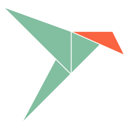



  

      

          

              <h1 class="display-4">We are not quite ready yet...</h1>
              
Gatekeeper is still under active development. We currently do not advise to run Gatekeeper in production as many of the features are not finished or hardened. If you're a developer and interested. You can however run the software locally.

          

      

  

    <h2 class="text-center">Official installation methods</h2>
    

        

            

                <a href="https://snapcraft.io/gatekeeper">
                    

                        
                            
                        
                        

                            <h5 class="card-title">Snap</h5>
                            
Automatic updates using Snap

                        

                    

                </a>
            

            

                <a href="https://github.com/GetGatekeeper/Server">
                    

                        
                            <i class="fas fa-code text-muted"></i>
                        
                        

                            <h5 class="card-title">Source</h5>
                            
Build from source yourself

                        

                    

                </a>
            

        


